# Social Network App

Red social construida en **ASP.NET Core MVC** con arquitectura **Onion** y **Entity Framework Core (Code-First)**.  
Incluye autenticación segura, gestión de perfiles, publicaciones, amigos y un minijuego de **Battleship** integrado.

## ⚙️ Funcionalidades principales

- Login y registro con activación por correo y recuperación de contraseña
- Publicaciones (Home): crear, editar y eliminar posts con texto + imagen o texto + video de YouTube
- Comentarios y respuestas en hilos anidados con foto de perfil
- Reacciones: "Me gusta" / "No me gusta"
- Gestión de amigos: agregar/eliminar, ver publicaciones, reproducir videos dentro de la app
- Solicitudes de amistad: aceptar, rechazar o eliminar solicitudes con validaciones
- Battleship 🎮:
  - Crear partidas con amigos
  - Fase de posicionamiento de barcos en tablero 12×12
  - Fase de ataque alterno hasta hundir todos los barcos
- Mi perfil: editar datos personales, foto y contraseña
- Seguridad con **Identity** y control de acceso

## 📂 Arquitectura – Onion Architecture

- Application → CQRS, DTOs, Validadores, ViewModels
- Domain → Entidades, enums, interfaces de repositorios
- Infrastructure → Persistencia, Identity, servicios externos
- WebApp (RedSocial) → MVC con vistas responsivas

## 🔧 Tecnologías usadas

- C# ASP.NET Core MVC
- Entity Framework Core (Code-First)
- Identity + JWT
- AutoMapper
- FluentValidation
- Bootstrap 5 (UI responsiva)
- 
## 🖼️ Screenshots
- Login/Register
  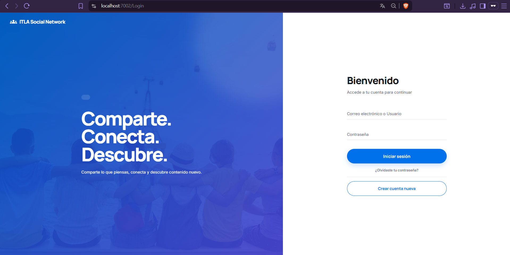
  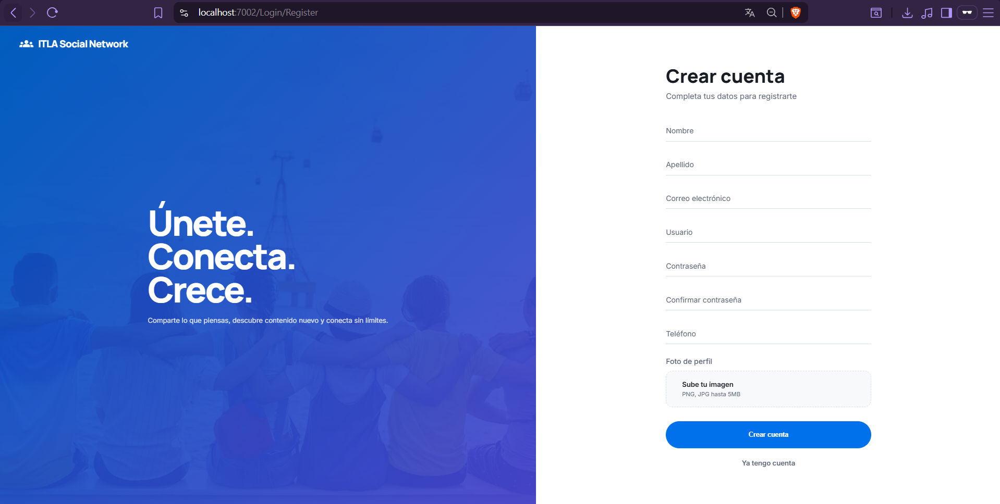
- Posts
  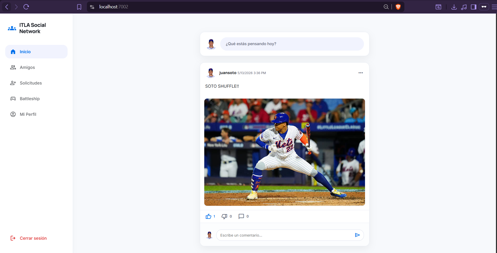
- Friends Posts
  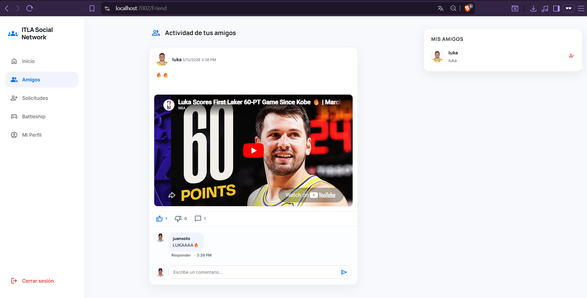
- Friend Requests
  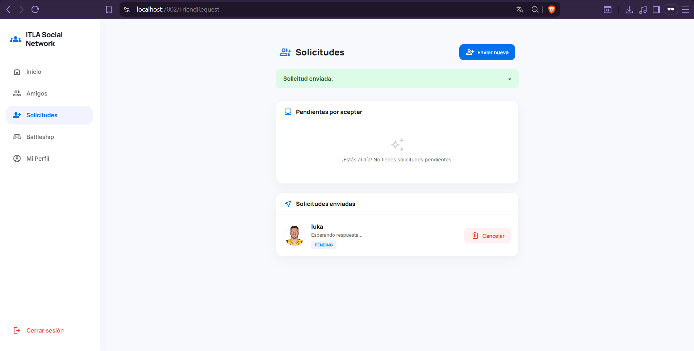
  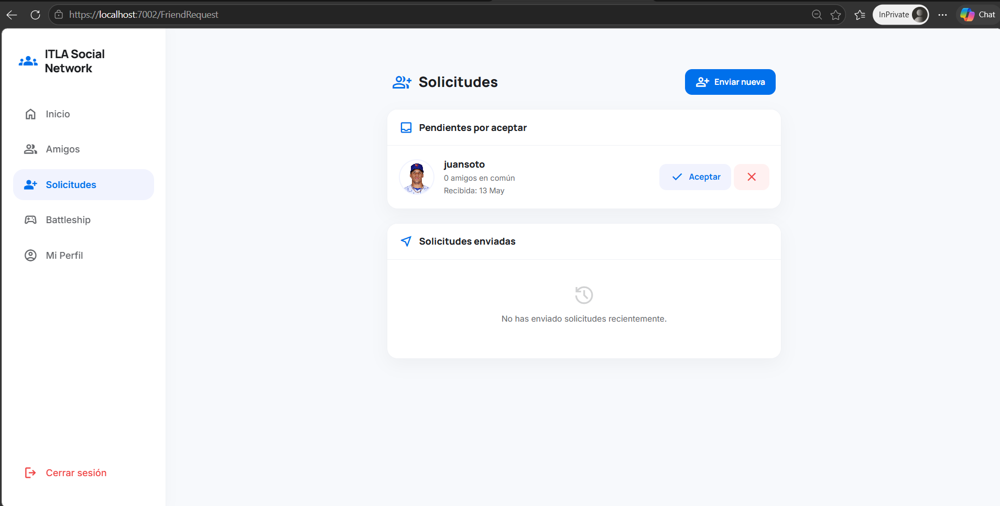
- BattleShip Game
  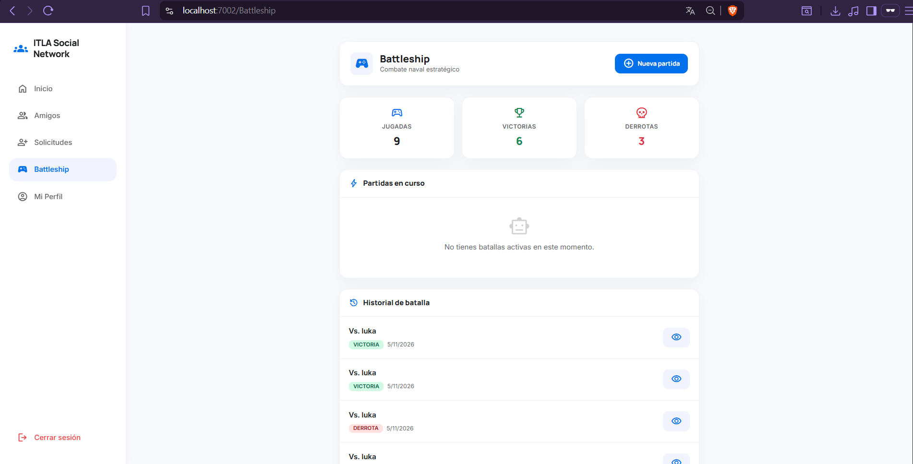
  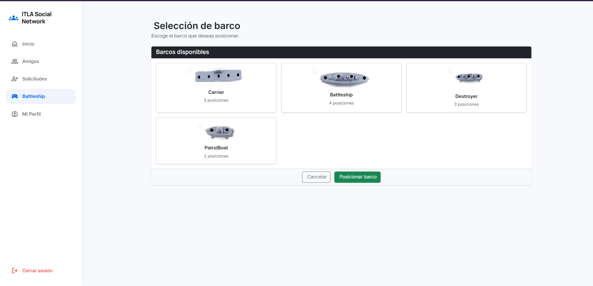
  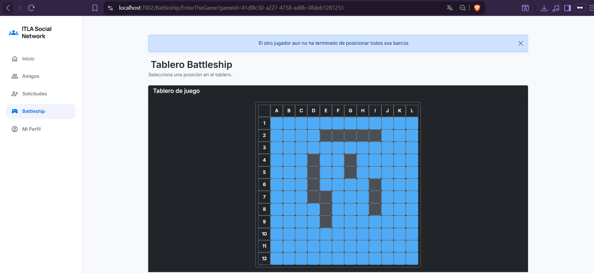
  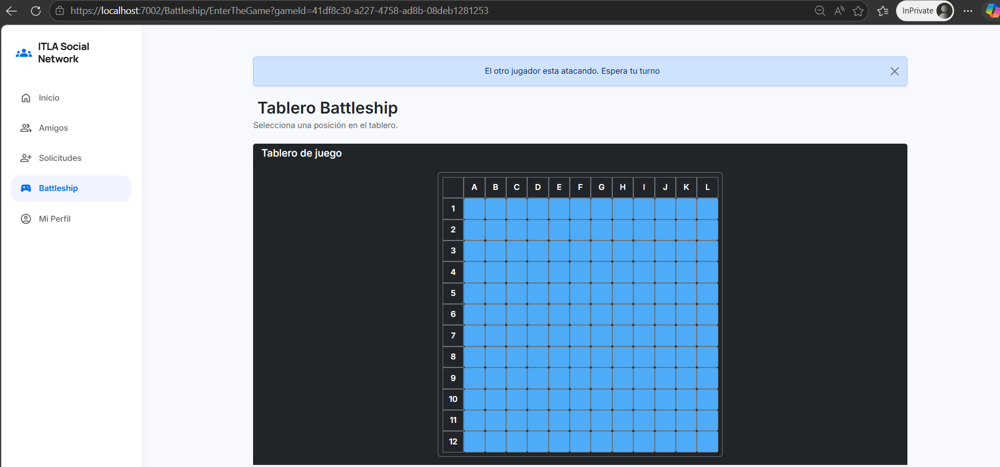
- My Profile
  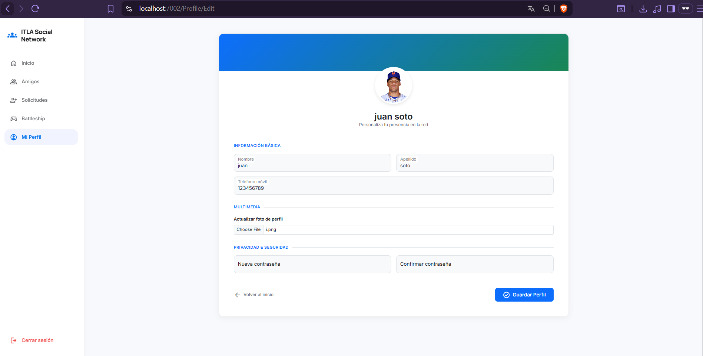
      
## 👨‍💻 Equipo de Desarrollo

- Eric Pineda
  - eccpineda@gmail.com  
- Yohansel Mieses
  - miesesyohansel@gmail.com
